# Keras Container on Nautilus

This project allows for the usage of Keras on a jupter notebook in Nautilus (as an importable package). With this project, we are able to train keras models on the Nautilus cloud. 

NOTE: This README is currently outdated and is a WIP.

## Getting Started

These instructions will get you a copy of the project up and running on your namespace. 

### Prerequisites

Nautilus namespace
Nvidia GPU

## Components

The project has the following components:
```
- Dockerfile (Dockerfile)
- Continous Integration Yaml (.gitlab-ci.yml)
- An example jupter notebook (ClassificationExample.ipynb)
- Nautilus deployment Yaml (kerasDeloyment.yaml)
```

### Dockerfile
```
This file is used to make the enviroment necessary to run Keras on Jupyter Notebook. Unless 
truely needed, please avoid editing this file.
```

### Continous Integration Yaml
```
This file is used to utilize gitlab's continous integration feature. Nautilus uses kaniko instead of docker, which can be changed back into using a docker image by replacing the current .gitlab-ci.yml with the "dockerBased-ci.yml" file.  
```

### Jupter notebook
```
This was the notebook I used to train an wildfire classification model. The structure and import commands can be used to utilize keras in 
other notebooks. I will go over the specific details below.  
```

### Nautilus Deployment Yaml

If you are planning to use this implementation on another Nautilus namespace, this portion of the readme is especially important. Here are the important aspects of this yaml:


1. Changing namespace address <br /> <br />
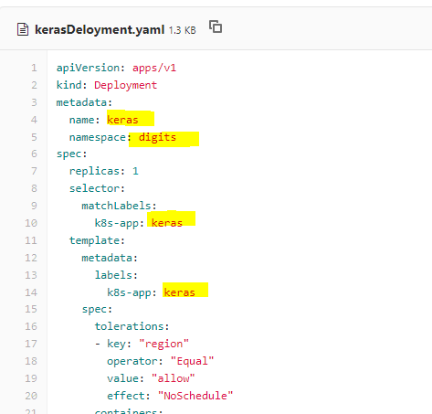 <br />
**Change the name and the namespace entries to the current working namespace and a suitable name**

2. Change the resource requests <br /> <br />
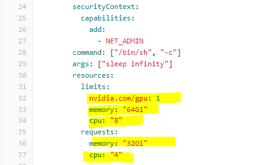 <br />
**Change the numbers to suit the task**


3. Mount volumne <br /><br />
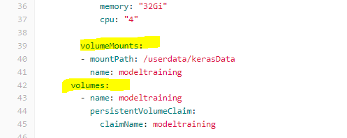 <br />
**Very important for crash-resistance. I highly recommend saving all work onto mounted directory** 


4. Choose GPU type <br /><br />
  <br />
If doing intensive training, choose larger/more expensive GPUs

## Using the Components

### Starting the development and accessing jupyter notebook 
1. Go into kerasDeloyment.yaml file
2. Choose the RAW file format <br />
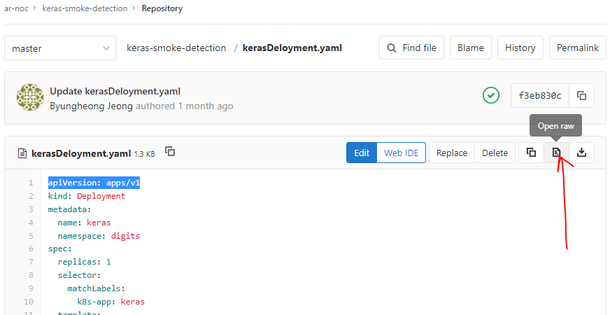 <br />

3. copy url of RAW file <br />
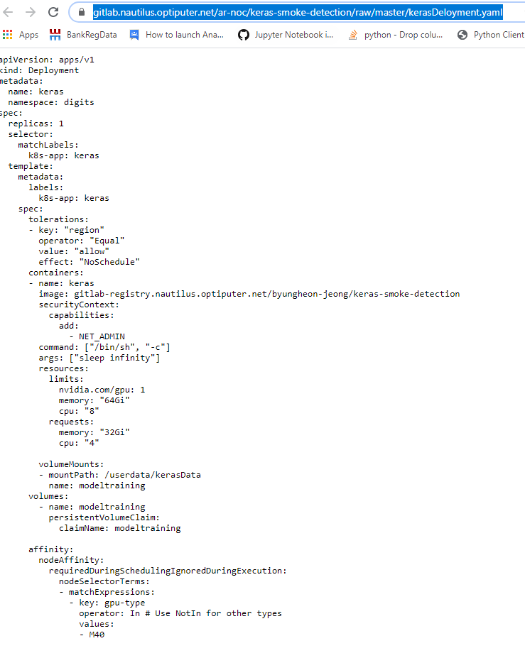 <br />

4. execute yaml file on nautilius namespace <br />
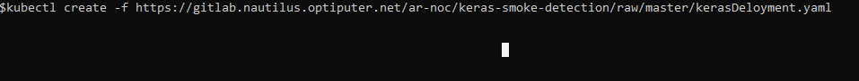

5. exec into nautilus pod <br />
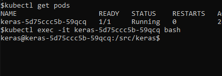

6. Navigate to /userdata/kerasData and Start Jupyter Notebook <br /><br />
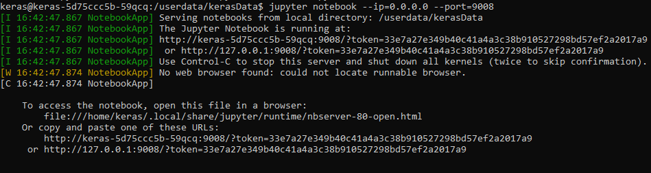<br />
**Note: The port number choice does not matter, as long as there are not other processes running on that port. If a port is already in use, jupyter will automatically assign another port. Make sure to match the port number in the next step** <br /> <br />
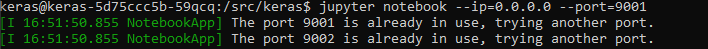<br />
_What happens when a wrong port is chosen_ <br />

7. Go to your computer terminal and start port-forward, matching the port in the pod <br />
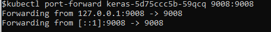<br />

8. Go to the localhost address<br />
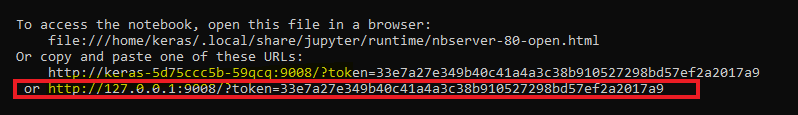<br />

9. Test for keras
Create a new notebook or use the ClassificationExample.ipynb file 
- Run the following tests <br />
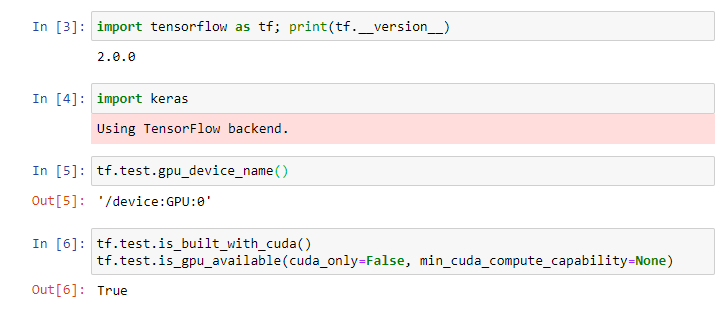 <br /><br />
<!-- <br /><br /> -->
**_Make sure that the outputs return True or some name._**<br />
**You are now ready to use Keras on a jupyter notebook hosted on Kubernetes**

### Using Keras in Notebook

#### EXTREMELY IMPORTANT!
In order to prevent Keras from assigning too much GPU memory and stalling training efforts later on, run this:
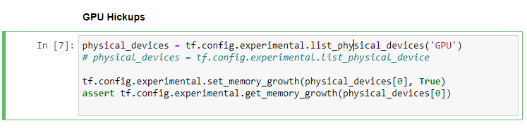 <br />
If you see an error, shutdown the network server and try again <br />
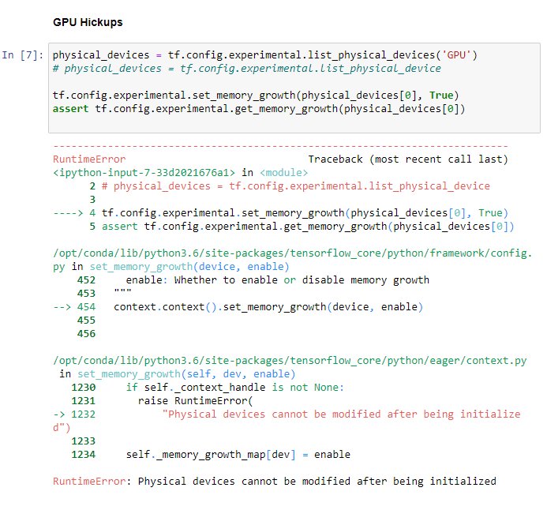<br/>
If you see nvidia-smi memory allocation at 0/- you have suceeded in reseting the GPU <br />
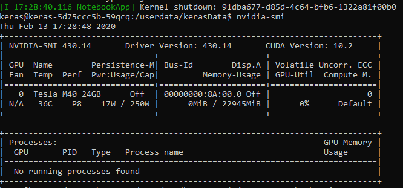<br />

Please refer to [Keras Documentation](https://keras.io/) for instructions and information

I used the notebook for the following:
- Training a CNN on the notebook for reference
- Using a LearningRateFinder to find the optimal learning rate


## Using the Fire-Classification training

1. Write the network using Keras layers  <br /> 
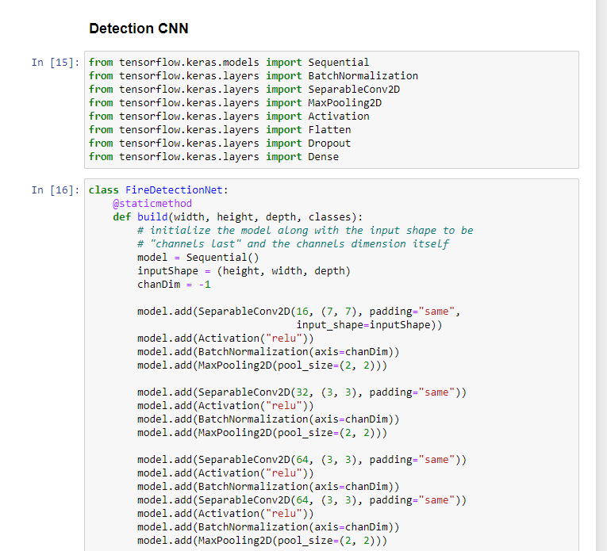 <br /> <br />
2. Set the paths  <br />
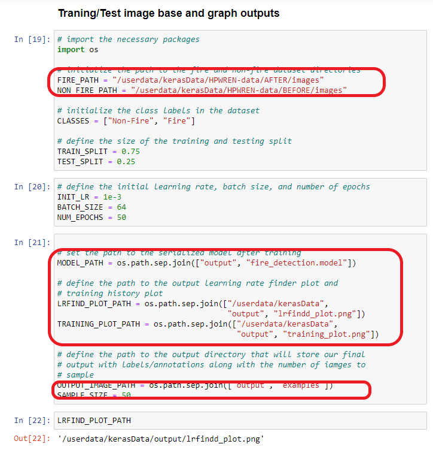 <br />
The following must be set
- FIRE_PATH = Path of the directory with the fire images
- Non_FIRE_PATH = Path of the directory with images without fire
- MODEL_PATH = Path where the saved model file should go
- LRFIND_PLOT_PATH = Where the learning rate finder graph should go
- TRAINING_PLOT_PATH = Where the training plot graph (loss & accuracy graphs) shoud go 
3. Loading Data
There shouldn't be a need to edit this, unless another data loading solution is desired. This section also splits the data into training  
4. Image Load Tester
Tests the images to see if the loading worked
5. Model Initialization <br />
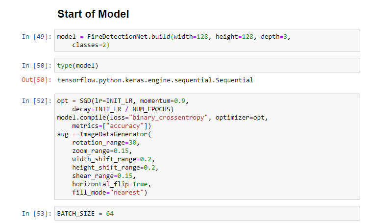<br />
- The width, height and depth is the data format. Classes are the number of condiitons in the data. In our case: ["Fire", "Not-Fire"]
- Change the optimization function if you know what you are doing. We are using a starndard SDG
6. Learning Rate Finder <br />
Run to find the place where the Network starts to learn
 <br />
 <br />
More information is availbe here [pyimagesearch](https://www.pyimagesearch.com/2019/08/05/keras-learning-rate-finder/)

Finally, fill out the INIT_LR from what you learned from above
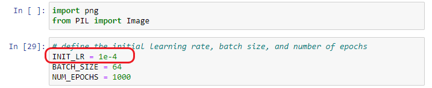<br />
7. Train <br />
 <br />
8. Get results <br />
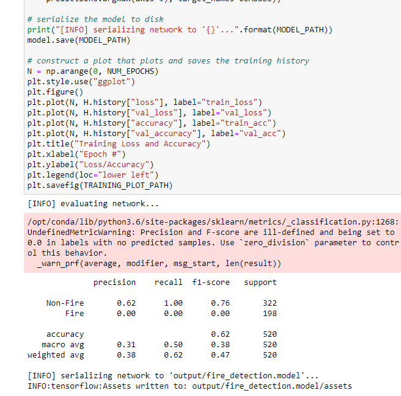 <br />
You will find the accuracy measures in the table. Find the model in fire_detection.model


## Contributors

* **Byungheon Jeong**  - [byungheon-jeong](https://gitlab.nautilus.optiputer.net/byungheon-jeong)
* **Spence Chen** - [Spencer](https://gitlab.nautilus.optiputer.net/Spencer123)
* **Isaac Nealey** - [Isacc](https://gitlab.nautilus.optiputer.net/inealey)
* **John Graham** - [John](https://gitlab.nautilus.optiputer.net/jjgraham)

## Acknowledgments

* The Dockerfile is from the Dockerhub of the Keras team
* The Fire CNN and the Learning Rate finder is adapted from Adrain's excellent blog on first-detection - [Pyimagesearch](https://www.pyimagesearch.com/2019/11/18/fire-and-smoke-detection-with-keras-and-deep-learning/)

